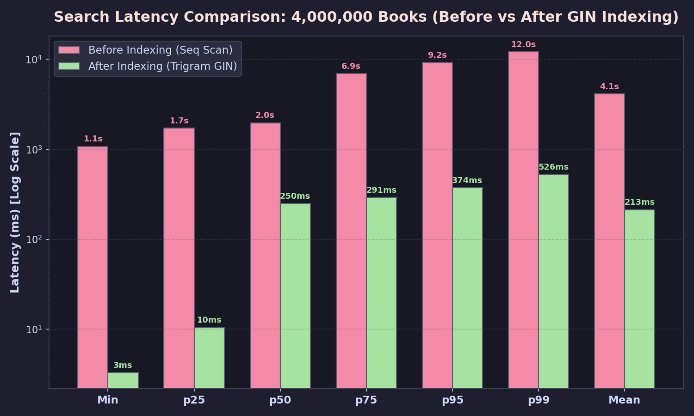

# Ketabdari (کتابداری) — Library Management API

API ساده و ماژولار مدیریت کتابخانه — مدیریت کاربران، کتاب‌ها و امانت (Rental) بر پایه FastAPI، SQLModel و PostgreSQL.

> 📈 **پرفورمنس و مقیاس‌پذیری:**
> - بهینه‌سازی کوئری‌های جوین و حذف سربار ORM (۳.۵× بهبود در `GET /rentals/overdue`).
> - بنچمارک جستجو روی **۴,۰۰۰,۰۰۰ کتاب یکتا** با ایندکس‌های Trigram GIN (`pg_trgm`) — بهبود **۱۹.۲×** در throughput و کاهش تأخیر p95 از ۹.۱ ثانیه به ۳۷۴ میلی‌ثانیه (**۲۴.۵× سریع‌تر**).
> - گزارش و تحلیل کامل: [`docs/PERFORMANCE.md`](docs/PERFORMANCE.md).



## استک
- **فریم‌ورک:** FastAPI + SQLModel + SQLAlchemy (Async) + asyncpg
- **دیتابیس:** PostgreSQL 16 (با اکستنشن `pg_trgm`)
- **تست‌ها:** pytest + pytest-asyncio + httpx (ASGI Transport) — ۳۷ تست

## راه‌اندازی سریع

```bash
# ۱) اجرای دیتابیس با داکر
docker compose up -d

# ۲) محیط مجازی و نصب پکیج‌ها
python3 -m venv .venv && source .venv/bin/activate
pip install -r requirements.txt
uvicorn app.main:app --host 0.0.0.0 --port 8888
```

- مستندات خودکار (Swagger): `http://localhost:8888/docs`
- دیتابیس روی پورت `5433` در دسترس است.

## اجرای تست‌ها

```bash
pip install -r requirements-dev.txt

# ساخت دیتابیس تست (یکبار):
PGPASSWORD=library psql -h 127.0.0.1 -p 5433 -U library -d library -c "CREATE DATABASE library_test;"

# اجرای تمامی تست‌ها:
pytest -v
```

## مشخصات اندپوینتها

| Method | Path | توضیح |
|--------|------|-------|
| POST | `/users` | ایجاد کاربر جدید |
| GET | `/users` | لیست کاربران (Pagination) |
| GET | `/users/{id}` | دریافت مشخصات کاربر |
| PATCH | `/users/{id}` | ویرایش مشخصات کاربر |
| DELETE | `/users/{id}` | حذف کاربر (در صورت داشتن رکورد امانت: `409`) |
| GET | `/users/{id}/rentals` | لیست امانت‌های یک کاربر |
| POST | `/books` | ایجاد کتاب جدید (`title`, `author`, `quantity`) |
| GET | `/books` | جستجو، صفحه‌بندی و مرتب‌سازی (`page`, `size`, `search`, `sort_by`, `order`) |
| GET | `/books/{id}` | دریافت مشخصات کتاب همراه با موجودی |
| PATCH | `/books/{id}` | ویرایش اطلاعات یا موجودی کتاب |
| DELETE | `/books/{id}` | حذف کتاب (در صورت داشتن تاریخچه امانت: `409`) |
| POST | `/rentals` | ثبت امانت جدید با قفل ردیف (`user_id`, `book_id`, `due_date`) |
| GET | `/rentals` | لیست کل امانت‌ها |
| GET | `/rentals/overdue` | لیست امانت‌های معوق |
| GET | `/rentals/{id}` | دریافت اطلاعات امانت |
| POST | `/rentals/{id}/return` | ثبت بازگشت کتاب و افزایش موجودی |

### قوانین بیزینس و کنترل همزمانی
- **کنترل موجودی:** امانت کتاب منوط به `quantity > 0` است. در صورت ناموجود بودن کتاب (`quantity == 0`) پاسخ `409` برمی‌گردد.
- **قفل ردیف (Row-Level Lock):** مسیرهای ثبت امانت و بازگشت کتاب با `SELECT ... FOR UPDATE` درون تراکنش اجرا می‌شوند تا درخواست‌های همزمان برای نسخه آخر دچار Race Condition نشوند و موجودی منفی نشود.
- **مرتب‌سازی:** پارامتر `sort_by` روی فیلدهای `id`، `created_at`، `title`، `name` و `quantity` با جهت‌های `asc` و `desc` کار می‌کند. فیلد نامعتبر با خطای `400` رد می‌شود.
- **تاریخ انقضا:** فیلد `due_date` باید در آینده باشد (`400`).
- **حذف رکوردها:** کاربر یا کتابی که سابقه امانت دارد حذف فیزیکی نمی‌شود (`409`).

## بنچمارک و اسکریپت‌ها

```bash
# تولید دیتای ۴M کتاب یکتا با asyncpg COPY در ~۲۸ ثانیه:
python3 scripts/seed_unique_books.py --count 4000000 --truncate

# ساخت ایندکس‌های trigram در دیتابیس:
PGPASSWORD=library psql -h 127.0.0.1 -p 5433 -U library -d library -f scripts/indexes.sql

# اجرای بنچمارک ۱۰۰۰ ریکوئستی جستجو:
python3 scripts/benchmark_search.py --count 1000 --concurrency 8 \
    --output-img docs/benchmarks/search_4m_indexed.png \
    --output-json docs/benchmarks/search_4m_indexed.json

# تست صحت فرآیند امانت و قفل ردیف در محیط لایو:
python3 scripts/verify_live_rental_flow.py
```

گزارش تحلیلی کامل بنچمارک‌ها و معماری همزمانی: [`docs/PERFORMANCE.md`](docs/PERFORMANCE.md)
