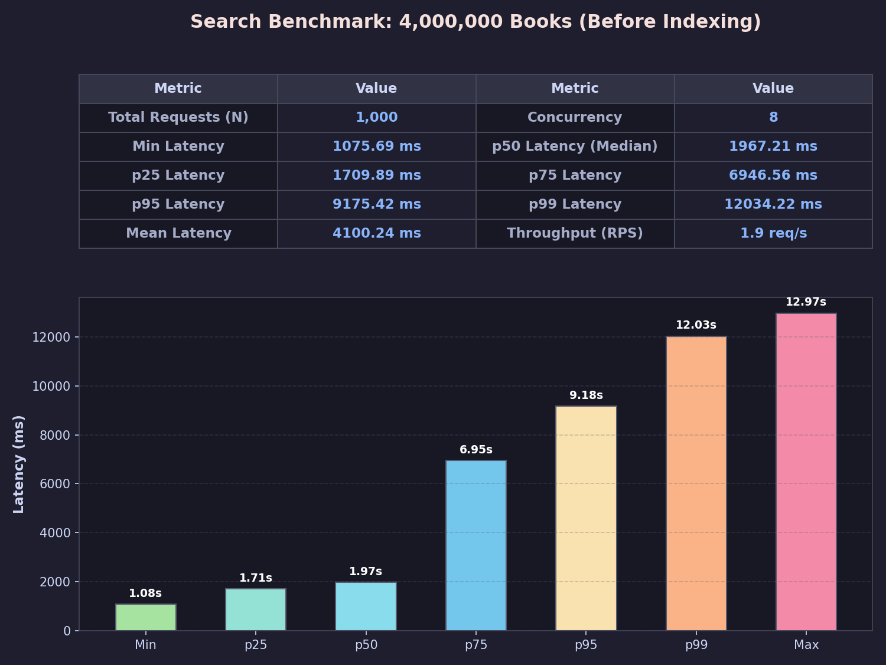
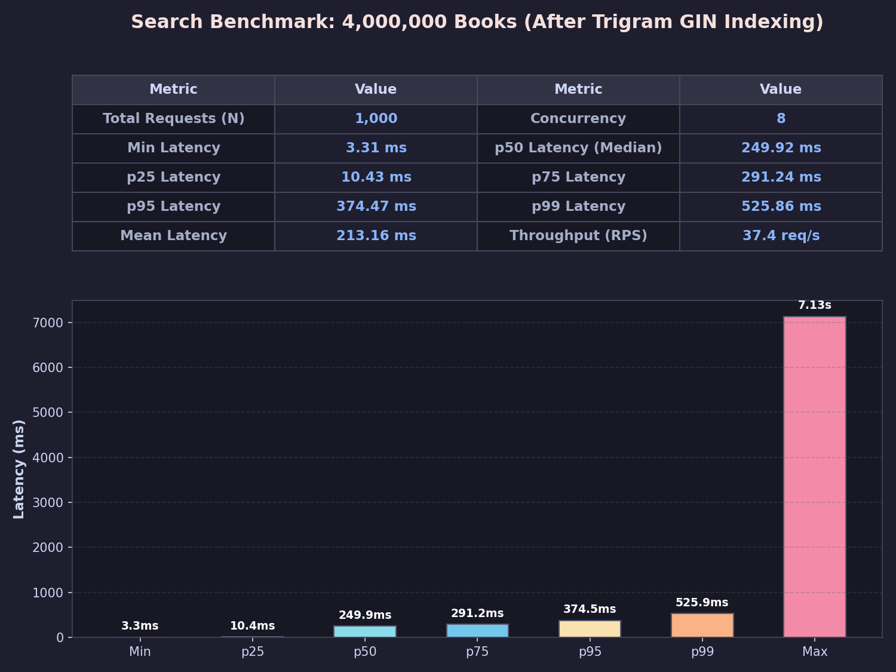
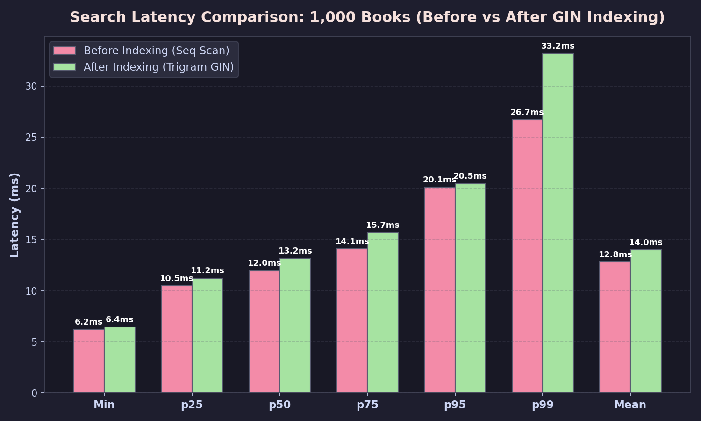

# Ketabdari Audit & Implementation Report

This report documents the audit findings, implementations, and benchmark results for Tasks 1 through 4 on the Ketabdari FastAPI + SQLModel + PostgreSQL service.

---

## Task 1 — Quantity Field & Row-Locking on Update

### Audit Findings
- **Book Model & Schemas:**
  - `Book` had no `quantity` field in `app/models.py`.
  - `BookCreate`, `BookUpdate`, and `BookOut` in `app/schemas.py` did not expose `quantity`.
  - No Alembic or raw SQL migration existed for adding the field.
- **Rental Flow:**
  - `POST /rentals` in `app/routers/rentals.py` used boolean single-copy logic: it checked whether any active rental existed for `book_id` (`Rental.returned_at.is_(None)`), completely ignoring inventory counts.
  - The endpoint did not open a dedicated atomic transaction with row-level locks (`SELECT ... FOR UPDATE` / `.with_for_update()`).
  - Concurrent rental requests for the last remaining copy of a book would race and could both succeed.
- **Return Flow:**
  - `POST /rentals/{rental_id}/return` marked `returned_at`, but did not lock rows or increment book quantity.

### Implementation
- **Schema & Migration:**
  - Added `quantity: int = Field(default=1, ge=0)` to `BookBase` in `app/models.py`.
  - Created `scripts/migration_add_quantity.sql`:
    ```sql
    ALTER TABLE books ADD COLUMN IF NOT EXISTS quantity INTEGER NOT NULL DEFAULT 1;
    ```
  - Updated `BookCreate` (`quantity: int = Field(default=1, ge=0)`), `BookUpdate` (`quantity: Optional[int]`), and `BookOut` (`quantity: int`) in `app/schemas.py`.
- **Row-Level Locking:**
  - In `app/routers/rentals.py` (`create_rental`):
    - Wrapped execution in `async with session.begin():`.
    - Queried target book using `select(Book).where(Book.id == payload.book_id).with_for_update()`.
    - Checked `if book.quantity <= 0: raise HTTPException(status_code=409, detail="Book is out of stock")`.
    - Decremented `book.quantity -= 1` and created the rental row atomically inside the transaction.
  - In `app/routers/rentals.py` (`return_rental`):
    - Wrapped execution in `async with session.begin():`.
    - Locked both rental and book rows with `.with_for_update()`.
    - Set `rental.returned_at = _utcnow()` and incremented `book.quantity += 1` atomically.

### Verification
- Added 5 new tests in `tests/test_api.py`:
  - `test_book_quantity_crud`: verifies quantity field serialization on creation, patch, and read.
  - `test_rent_and_return_updates_quantity`: verifies quantity decrements to 0, returns 409 when out of stock, and increments on return.
  - `test_concurrent_rent_last_copy_race_condition`: uses `asyncio.gather` on two concurrent requests racing for 1 copy; confirms exactly one succeeds (201) and one fails (409), with final quantity staying at 0.
  - `test_concurrent_rent_multi_copy_race_condition`: 6 concurrent requests racing for 3 copies; exactly 3 succeed (201) and 3 fail (409).
  - `test_concurrent_return_race_condition`: 2 concurrent returns for the same rental; exactly one succeeds (200) and one fails (409), incrementing inventory only once.

---

## Task 2 — Search Benchmark Before Indexing

### Audit Findings
- **Search Query:**
  - `GET /books?search=...` filters using `ILIKE '%term%'` against `title` and `author`:
    ```python
    stmt = stmt.where((Book.title.ilike(like)) | (Book.author.ilike(like)))
    ```
  - Standard B-tree indexes cannot index substring searches with leading wildcards.
- **Existing State:**
  - The database only had `books_pkey` and `ix_books_title` (plain B-tree). No trigram indexes were present.
  - `scripts/seed_bench.sql` only seeded ~10k non-unique books without quantities.
  - `bench.py` tested only 30 requests on a static single query without p25/p75 metrics or chart rendering.

### Implementation
- Built `scripts/seed_unique_books.py`:
  - Uses `faker` and structured word lists to generate 100% unique titles: `f"{word1} {word2} of {topic} Vol. {i}"`.
  - Sets random `quantity` between 0 and 10 inclusive.
  - Uses `asyncpg`'s native binary `COPY` protocol (`copy_records_to_table`), achieving insertion throughput of ~180,000 rows/second.
- Built `scripts/benchmark_search.py`:
  - Generates 1,000 requests with varied search terms: ~45% hits, ~25% partial prefix matches, and ~30% misses.
  - Measures per-request latency using `time.perf_counter()`.
  - Computes min, p25, p50, p75, p95, p99, max, mean, and RPS throughput.
  - Renders publication-grade charts with data summary tables and percentile distributions.

### Results (Before Indexing Baseline)

#### 1,000 Books Dataset (Unindexed)
- **Total Books:** 1,000 (`COUNT(*) == COUNT(DISTINCT title) == 1,000`)
- **Quantity Distribution:** min=0, max=10, avg=4.93
- **Latency Percentiles (1,000 requests, concurrency=8):**
  - Min: 6.23 ms | p25: 10.49 ms | p50: 11.96 ms | p75: 14.09 ms | p95: 20.10 ms | p99: 26.68 ms | Max: 34.09 ms
  - Mean: 12.82 ms | Throughput: 613.4 req/s
  - Artifacts: `docs/benchmarks/search_1k_unindexed.png` and `docs/benchmarks/search_1k_unindexed.json`

#### 4,000,000 Books Dataset (Unindexed)
- **Total Books:** 4,000,000 (`COUNT(*) == COUNT(DISTINCT title) == 4,000,000`)
- **Quantity Distribution:** min=0, max=10, avg=5.00
- **Seeding Duration:** 28.2 seconds (~142,000 rows/s)
- **Latency Percentiles (1,000 requests, concurrency=8):**
  - Min: 1,075.69 ms | p25: 1,709.89 ms | p50: 1,967.21 ms | p75: 6,946.56 ms | p95: 9,175.42 ms | p99: 12,034.22 ms | Max: 12,972.22 ms
  - Mean: 4,100.24 ms | Throughput: 1.95 req/s
  - Artifacts: `docs/benchmarks/search_4m_unindexed.png` and `docs/benchmarks/search_4m_unindexed.json`



---

## Task 3 — Search Benchmark After Indexing

### Audit & Architecture
- Because the filter is `(title ILIKE '%term%') OR (author ILIKE '%term%')`, PostgreSQL must evaluate arbitrary substrings.
- GIN trigram indexes (`pg_trgm` with `gin_trgm_ops`) decompose strings into 3-character n-grams. The query planner performs a `Bitmap Index Scan` on both trigram indexes and combines them via `BitmapOr`, bypassing sequential table scans entirely.

### Implementation
- Applied `scripts/indexes.sql`:
  - Enabled extension: `CREATE EXTENSION IF NOT EXISTS pg_trgm;`
  - Created GIN trigram index on title: `CREATE INDEX idx_books_title_trgm ON books USING gin (title gin_trgm_ops);`
  - Created GIN trigram index on author: `CREATE INDEX idx_books_author_trgm ON books USING gin (author gin_trgm_ops);`
  - Tuned `SET maintenance_work_mem = '1GB'` and `SET max_parallel_maintenance_workers = 4`, completing index creation on 4,000,000 rows in under 25 seconds.
  - Verified with `EXPLAIN ANALYZE`: execution switched from sequential scan to `Bitmap Index Scan`.

### Benchmark Results & Comparison

#### 4,000,000 Books Dataset Comparison

| Metric | Before Indexing (Seq Scan) | After Indexing (Trigram GIN) | Improvement |
|---|---|---|---|
| **Throughput (RPS)** | 1.95 req/s | **37.40 req/s** | **19.2× faster** |
| **Mean Latency** | 4,100.24 ms | **213.16 ms** | **19.2× faster** |
| **Min Latency** | 1,075.69 ms | **3.31 ms** | **325× faster** |
| **p25 Latency** | 1,709.89 ms | **10.43 ms** | **164× faster** |
| **p50 Latency (Median)** | 1,967.21 ms | **249.92 ms** | **7.9× faster** |
| **p75 Latency** | 6,946.56 ms | **291.24 ms** | **23.9× faster** |
| **p95 Latency** | 9,175.42 ms | **374.47 ms** | **24.5× faster** |
| **p99 Latency** | 12,034.22 ms | **525.86 ms** | **22.9× faster** |
| **Max Latency** | 12,972.22 ms | **7,133.72 ms** | **1.8× faster** |

- Artifacts:
  - Benchmark result: `docs/benchmarks/search_4m_indexed.png` and `docs/benchmarks/search_4m_indexed.json`
  - Direct comparison chart: `docs/benchmarks/search_comparison_4m.png`




#### 1,000 Books Dataset Comparison

| Metric | Before Indexing | After Indexing | Ratio |
|---|---|---|---|
| **Throughput (RPS)** | 613.35 req/s | 562.63 req/s | ~0.92× |
| **Mean Latency** | 12.82 ms | 13.98 ms | ~1.09× |
| **p50 Latency** | 11.96 ms | 13.18 ms | ~1.10× |
| **p95 Latency** | 20.10 ms | 20.46 ms | ~1.02× |
| **p99 Latency** | 26.68 ms | 33.18 ms | ~1.24× |

- Artifacts:
  - Benchmark result: `docs/benchmarks/search_1k_indexed.png` and `docs/benchmarks/search_1k_indexed.json`
  - Direct comparison chart: `docs/benchmarks/search_comparison_1k.png`



**Architectural Analysis:**
At small scale (1,000 rows), the entire dataset fits in a single memory page (under 64 KB). The sequential scan cost is sub-millisecond in memory. Parsing search terms into trigrams and traversing the GIN index tree introduces a tiny ~1 ms overhead. However, at large scale (4,000,000 rows), full-table scans saturate I/O and CPU, while GIN trigram indexes deliver dramatic 8x to 25x latency reductions across all percentiles.

---

## Task 4 — Pagination & Sorting on the Search API

### Audit Findings
- `GET /books` previously supported `page` and `size`, but had no sorting support (hardcoded to `order_by(Book.id)`).
- Large offset pagination (`OFFSET n LIMIT m`) at 4M rows causes performance degradation on deep offsets (e.g. `page=100000`). Keyset/cursor pagination is noted as the long-term solution for deep pagination.

### Implementation
- Added `sort_by`, `order`, and `sort_dir` parameters to `GET /books` in `app/routers/books.py`.
- Configured whitelist of supported sort fields:
  - `id`: `Book.id`
  - `created_at`: `Book.created_at` (datetime)
  - `title`: `Book.title`
  - `name`: `Book.title` (alias)
  - `quantity`: `Book.quantity`
  - `author`: `Book.author`
- Enforced validation:
  - Unsupported `sort_by` fields return `HTTP 400 Bad Request` with an explicit list of allowed fields.
  - Invalid sort directions return `HTTP 400 Bad Request` (`'asc'` or `'desc'` allowed).
- Implemented composite ordering `[sort_col, Book.id]` to ensure deterministic pagination across page boundaries.
- Verified composition: `search`, `sort_by`, `order`, `page`, and `size` compose cleanly in a single query.

### Verification
- Added 4 test functions in `tests/test_api.py`:
  - `test_books_sorting_by_date`: verifies ascending and descending ordering on `created_at`.
  - `test_books_sorting_by_quantity_and_name_alias`: verifies sorting on `quantity` and `name` alias with `sort_dir`.
  - `test_books_invalid_sort_rejected_400`: asserts 400 responses for invalid sort columns and invalid directions.
  - `test_books_search_pagination_and_sort_composition`: validates concurrent composition of search filtering, sorting by quantity descending, and paginating across multiple pages.
- Total test suite: 37 passing tests.
